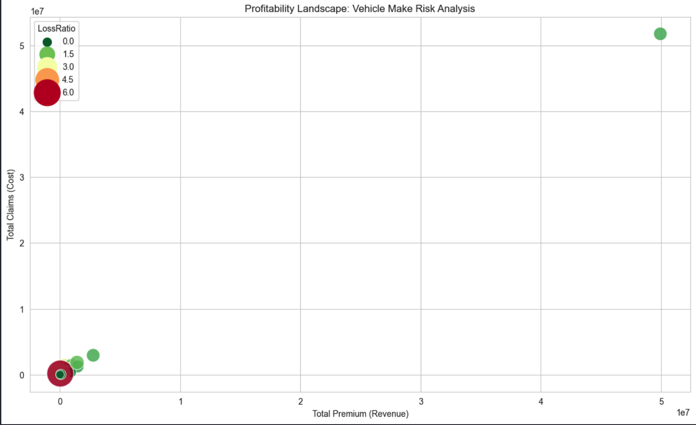
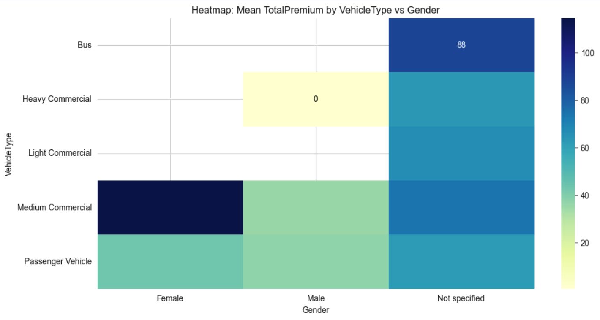

# 🛡️ Machine Learning for Insurance Risk Rating


> **Repository:** [https://github.com/zemicahel/week3](https://github.com/zemicahel/week3)

## 📖 Executive Summary
This project focuses on building a robust data pipeline and predictive models for **AlphaCare Insurance Solutions**. The goal is to transition from traditional linear pricing models to data-driven, machine learning-based risk scoring. 

This repository covers **Week 3** of the engagement, focusing on **Exploratory Data Analysis (EDA)**, **Statistical Profiling**, and establishing a **Data Version Control (DVC)** pipeline to ensure auditability and reproducibility in a regulated financial environment.

---

## 📂 Project Structure

```text
├── .dvc/                  # DVC configuration files
├── .github/workflows      # CI/CD pipelines (if applicable)
├── data/                  # Raw and processed data (tracked by DVC)
│   ├── .gitignore         # Ignores large data files
│   └── MachineLearningRating_v3.txt.dvc  # DVC pointer file
├── images/                # Generated plots and figures for reporting
├── notebooks/             # Jupyter Notebooks for analysis
│   └── 01_analysis.ipynb
├── scripts/               # Modular Python scripts
│   ├── __init__.py
│   ├── loader.py          # Data ingestion
│   ├── cleaner.py         # Preprocessing & typing
│   ├── eda_stats.py       # Statistical calculations
│   └── visualizer.py      # Plotting logic
├── .gitignore             # Git ignore rules
├── INTERIM_REPORT.md      # Detailed Phase 1 Report
├── README.md              # Project documentation
└── requirements.txt       # Python dependencies
📊 Key Findings (EDA)

Our analysis of the historical policy dataset revealed critical insights into the portfolio's risk profile:

Zero-Inflated Claims: Over 95% of policies have zero claims. This extreme skewness suggests that standard linear regression is unsuitable; future modeling will utilize Tweedie loss functions or Two-Stage models (Classification + Regression).

Geographic Risk: While major metropolitan provinces (Gauteng, Western Cape) generate the most premiums, they also exhibit specific high-frequency claim clusters.

Vehicle Make Profitability: A "Profitability Landscape" analysis identified specific vehicle makes that are consistently underpriced (High Claims vs. Low Premiums) versus those that drive profit.

Visual Insights
Profitability Landscape	Risk Heatmap


	


Premium vs. Claims by Make	Premium by Gender & Vehicle Type
🛠️ Data Engineering & DVC Setup

To comply with financial auditing standards, this project uses DVC (Data Version Control). This ensures that every model result can be traced back to the exact version of the data used to train it.

How it works:

Git tracks the code and the .dvc metadata files (pointers).

DVC tracks the large dataset (MachineLearningRating_v3.txt).

Local Remote: A local directory simulates a secure S3 bucket for storage.

Data Versioning Capability

Version 1: Raw data ingestion.

Version 2: Simulated data updates.

Rollback: The system allows for instant rollback to previous data states using dvc checkout.

🚀 Installation & Setup

To replicate this analysis on your local machine:

1. Clone the Repository
code
Bash
download
content_copy
expand_less
git clone https://github.com/zemicahel/week3.git
cd week3
2. Set up Virtual Environment
code
Bash
download
content_copy
expand_less
python3 -m venv .venv
source .venv/bin/activate  # On Windows: .venv\Scripts\activate
pip install -r requirements.txt
3. Initialize DVC

Since the remote storage is local to the original machine, you may need to initialize your own local storage to test the pipeline:

code
Bash
download
content_copy
expand_less
dvc init
mkdir /tmp/dvc_storage
dvc remote add -d localstorage /tmp/dvc_storage
4. Run the Analysis

Open the Jupyter Notebook to run the EDA pipeline:

code
Bash
download
content_copy
expand_less
jupyter notebook notebooks/analysis.ipynb
📝 Author

Zemicahel


